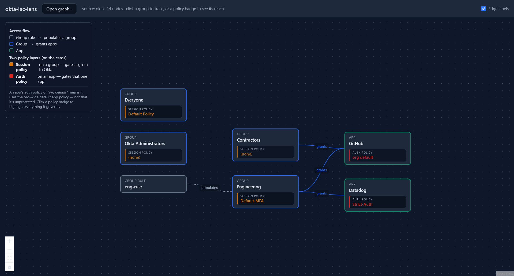
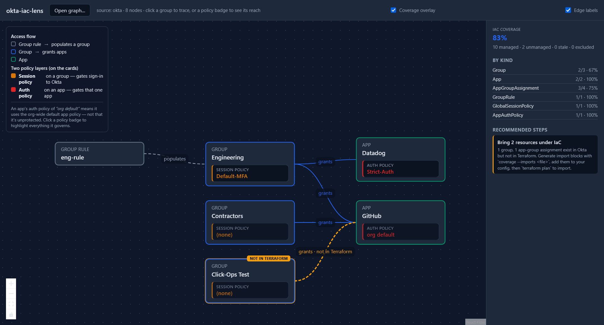

# okta-iac-lens

Local-first tool that reads Terraform-managed Okta config, **visualizes access paths**, and
**measures how much of the org is under IaC**. Generic Terraform visualizers draw resource
dependency graphs; this one understands Okta access semantics — who can reach what, and under
which policies.

See [`CLAUDE.md`](CLAUDE.md) for durable design context and [`PLAN.md`](PLAN.md) for the
current milestone.

## What it does

- **Trace access paths** (M1) — from a `terraform show -json` export or the live tenant, build
  the Okta graph and answer "what does group X grant, and under which policies?"
- **Read the live tenant** (M2) — a read-only reader emits the same normalized shape as the
  state parser, so the graph and traversal are identical whichever source you use.
- **Measure IaC coverage** (M3) — reconcile the live tenant against Terraform state, report the
  gap, and generate ready-to-apply `import` blocks for what's unmanaged.
- **Visualize** (M4) — a local, static web viewer renders the access flow (group rule → group →
  app) with each resource's **session policy** and **app auth policy** shown as attributes on
  its card. Click a group to trace its access; click a policy badge to see everything it governs.
- **Coverage overlay** (M5) — the viewer badges every card and assignment edge as managed /
  not-in-Terraform / Okta-managed, with a coverage %, per-kind breakdown, and prioritized
  **recommended steps** for closing the gap — the same guidance the `coverage` CLI prints.

### Access-path viewer



The two policy layers are kept visually distinct — a group's **session policy** (gates sign-in
to Okta) and an app's **auth policy** (gates that one app) are different things, never merged.
An app with no auth policy shows **"org default,"** never blank.

### Coverage overlay



A resource created outside Terraform (here, a click-ops group and its app assignment) is flagged
**not in Terraform** on the card and its `grants` edge, the coverage panel drops below 100%, and
the recommended steps say exactly how to bring it under IaC (`coverage --imports` → `terraform
plan`). Run `coverage --viz <path>` to produce a graph the viewer can open.

## Commands

```sh
npm install                 # install deps
npm test                    # run vitest once
npm run build               # tsc -> dist/  (CLI)
npm run dev -- <args>       # run the CLI without building (tsx src/cli.ts)

# trace + summary (state file or live tenant via --source okta)
npm run dev -- summary  --state fixtures/sample-tenant.tfstate.json
npm run dev -- trace    --group "Engineering" --state fixtures/sample-tenant.tfstate.json

# IaC coverage: live tenant vs Terraform state, with import blocks for the gap
npm run dev -- coverage --state generated/seed-state.json --imports generated/imports.tf

# export a graph for the viewer, then open the viewer
npm run dev -- export   --state fixtures/sample-tenant.tfstate.json -o generated/graph.json
npm run web                 # Vite dev server for the viewer
npm run web:build           # static bundle -> dist-web/
```

Live mode (`--source okta`, and `coverage`) reads credentials from env vars
(`OKTA_ORG_URL`, `OKTA_API_TOKEN`); copy [`.env.example`](.env.example) to `.env`.

## Safety

- Everything against Okta is **read-only**, against a **free Integrator test tenant**, never
  production. The credential is a Read-Only Administrator SSWS token; a write probe returns 403.
- State files and live exports contain secrets and PII. `.gitignore` excludes `.env`,
  `*.tfstate` / `*.tfstate.json`, and `generated/` (the fake-data fixture is the sole, explicit
  exception). Credentials live in env vars only — never hardcoded, never committed.
- The viewer is fully static and makes no network calls; it only opens a graph JSON you export.
