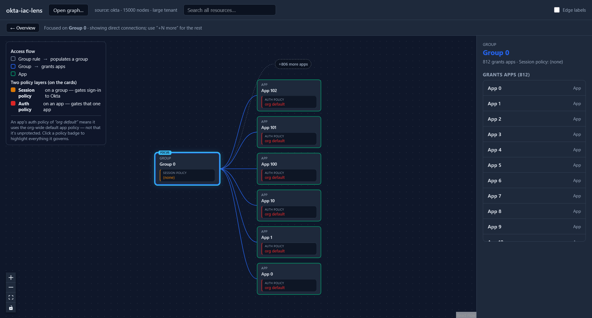
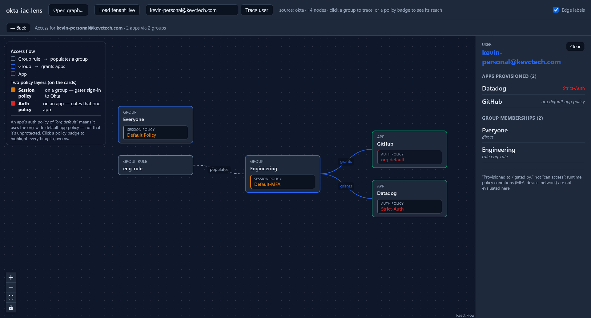

# okta-iac-lens

Local-first tool that reads Terraform-managed Okta config, **visualizes access paths**, and
**measures how much of the org is under IaC**. Generic Terraform visualizers draw resource
dependency graphs; this one understands Okta access semantics — who can reach what, and under
which policies — and stays legible at enterprise scale (thousands of apps/groups) by making every
canvas render a **bounded focus view**, never the whole graph.

See [`CLAUDE.md`](CLAUDE.md) for durable design context and [`PLAN.md`](PLAN.md) for the
current milestone.

## What it does

- **Trace access paths** (M1) — from a `terraform show -json` export or the live tenant, build
  the Okta graph and answer "what does group X grant, and under which policies?"
- **Read the live tenant** (M2) — a read-only reader emits the same normalized shape as the
  state parser, so the graph and traversal are identical whichever source you use.
- **Measure IaC coverage** (M3) — reconcile the live tenant against Terraform state, report the
  gap, and generate ready-to-apply `import` blocks for what's unmanaged.
- **Visualize** (M4) — a local, static web viewer renders the access flow (group rule → group →
  app) with each resource's **session policy** and **app auth policy** shown as attributes on
  its card. Click a group to trace its access; click a policy badge to see everything it governs.
- **Coverage overlay** (M5) — the viewer badges every card and assignment edge as managed /
  not-in-Terraform / Okta-managed, with a coverage %, per-kind breakdown, and prioritized
  **recommended steps** for closing the gap — the same guidance the `coverage` CLI prints.
- **Enterprise scale** (M6) — above a size threshold the viewer goes **query-first**: search +
  cohort landing + per-kind inventory, where every canvas render is a **bounded focus view**
  (one resource and its direct neighbors) with **hub truncation** — never the whole graph. The
  view definition, not the renderer, is what stays bounded, so legibility holds at 5k apps /
  10k groups / 60k assignments. Below the threshold, the full M4/M5 canvas renders unchanged.
- **User access trace** (M7) — `trace --user <email>` answers the question an IT engineer
  actually asks: *what is this person provisioned to, and how?* It looks up one user live
  (read-only), then feeds their group memberships through the same group→app→policy machinery —
  a **user is a trace input, never a graph node**, so it scales without adding user nodes. Each
  app is shown with its granting group, whether that group is **rule-populated** (the rule
  expression is surfaced, never evaluated) or a direct membership, and both policy gates.
  `--app <name>` narrows to one app and, on no access, explains *why not* (which groups grant it
  and their governing rules). The wording is deliberately **"provisioned to / gated by," never
  "can access"** — a static read can't account for runtime policy conditions (MFA, device,
  network), and the output says so.
- **Risk-ranked landing** (M8) — `risk` (CLI) and the viewer inventory rank apps and groups by a
  composite an IT engineer cares about: **reach** (how many groups grant an app / apps a group
  grants) × **gate prior** (org-default / no session policy = `default`; a custom policy =
  `custom`) × **IaC status** (not-in-Terraform, from coverage). "Widest reach, default gate, not in
  Terraform" sorts first. The gate prior is a **documented heuristic** — org-default is more-often-
  than-not the looser gate, so it scores higher-risk — **not a proven weak/strong verdict** (the
  model carries no rule/factor data yet; that's M15). The ranking is **legible, not a black box** —
  every row shows the raw signals next to the score. The focus view also reads blast-radius in
  ticket words: *"42 apps and 3 rules depend on this group."*
- **Live mode + visual user trace** (M9) — run `npm run web` with credentials and the viewer gains a
  **local read-only server** (browser → localhost → Okta): **Load tenant live** pulls the tenant with
  no export step, and **tracing a user by email** renders *their* access **on the canvas** — their
  groups → granted apps with both policy layers as badges — beside the textual breakdown. The
  **SSWS token stays server-side** (never in the browser; the browser only computes the same pure
  `traceUser` the CLI uses). Opened as a static file with no server, the viewer is exactly as
  before: fully offline, file-open only.
- **Policy outliers** (M10) — `outliers` (CLI) and a ranked table in the viewer surface apps whose
  auth policy **diverges from their peers**, where peers = the apps granted to the same group
  (same audience, so the org default is that audience's likely-loosest gate). An org-default app
  among peers that are ≥2/3 behind a custom policy is flagged **default-while-peers-custom**;
  custom-vs-custom mismatches are **differs-from-peers**. Both are **divergences, not proven
  weaknesses** — the model deliberately carries no policy contents (rule/factor strength lands in
  M15), and every surface says so. Every row carries its evidence: *"in Engineering
  (11 apps): 9/11 peers behind Strict-Auth."* A hardened app among org-default peers is never
  flagged — that's the expected crown-jewel pattern, not an outlier. The viewer adds a bounded
  **Group×Policy heatmap** (top policies + Other + Org default as columns, biggest audiences as
  rows) where the dominant cell is outlined and divergent cells are tinted; click a cell to list
  its apps.

### Access-path viewer


The two policy layers are kept visually distinct — a group's **session policy** (gates sign-in
to Okta) and an app's **auth policy** (gates that one app) are different things, never merged.
An app with no auth policy shows **"org default,"** never blank.

### Coverage overlay


A resource created outside Terraform (here, a click-ops group and its app assignment) is flagged
**not in Terraform** on the card and its `grants` edge, the coverage panel drops below 100%, and
the recommended steps say exactly how to bring it under IaC (`coverage --imports` → `terraform
plan`). Run `coverage --viz <path>` to produce a graph the viewer can open.

### Scale: bounded focus view



A 15,000-node tenant, kept legible. Instead of rendering the whole graph, the viewer focuses one
resource (here **Group 0**, a hub granting 812 apps) and shows only its direct neighbors; the
fan-out is truncated to the top edges plus a **"+806 more apps"** aggregate that opens the
browsable list (right panel). Click any neighbor to re-focus and walk the graph one bounded hop
at a time. No canvas render depends on org size. Reproduce with `npm run gen:scale`.

### User access trace



Live mode (M9): type a user's email and their access renders **on the canvas** — memberships →
granted apps with both policy layers as badges — beside the full breakdown (provenance per group,
gate per app). The lookup runs on the local server; the SSWS token never enters the browser.

The same trace on the CLI (ids redacted), validated against the Okta admin console:

```
User: ada@example.com (00u...)

Apps provisioned (2):
  - Datadog (0oa...)  ·  via: Engineering  ·  app gate: Strict-Auth (rst...)
  - GitHub (0oa...)  ·  via: Engineering  ·  app gate: — org default app sign-on policy

Group memberships (2):
  - Everyone (00g...)  ·  direct or app-push membership  ·  session gate: Default Policy (00p...)
  - Engineering (00g...)  ·  populated by rule eng-rule (`user.department=="Engineering"`)  ·  session gate: Default-MFA (00p...)

Note: "provisioned to / gated by" reflects assignment; runtime policy conditions (MFA, device, network) are not evaluated here.
```

Every claim is honest by construction: provenance says a rule *populates* the group (never that
it admitted this user — that's unknowable from a static read), expressions are shown verbatim and
never evaluated, and the caveat rides on every trace.

## Commands

```sh
npm install                 # install deps
npm test                    # run vitest once
npm run build               # tsc -> dist/  (CLI)
npm run dev -- <args>       # run the CLI without building (tsx src/cli.ts)

# trace + summary (state file or live tenant via --source okta)
npm run dev -- summary  --state fixtures/sample-tenant.tfstate.json
npm run dev -- trace    --group "Engineering" --state fixtures/sample-tenant.tfstate.json
npm run dev -- trace    --app   "GitHub"      --state fixtures/sample-tenant.tfstate.json

# user access trace (live, read-only): what is this person provisioned to, and how?
npm run dev -- trace    --user  "ada@example.com" --source okta
npm run dev -- trace    --user  "ada@example.com" --app "GitHub" --source okta  # explain one app

# risk-ranked inventory: reach × gate prior × IaC status (widest/default-gated/unmanaged first)
npm run dev -- risk --source tfstate --state fixtures/sample-tenant.tfstate.json
npm run dev -- risk --iac --state fixtures/sample-tenant.tfstate.json   # + IaC signal (live vs state)

# policy outliers: apps diverging from their peer set's dominant auth policy
npm run dev -- outliers --state fixtures/sample-tenant.tfstate.json
npm run dev -- outliers --source okta                                   # live tenant

# IaC coverage: live tenant vs Terraform state, with import blocks for the gap
npm run dev -- coverage --state generated/seed-state.json --imports generated/imports.tf

# export a graph for the viewer, then open the viewer
npm run dev -- export   --state fixtures/sample-tenant.tfstate.json -o generated/graph.json
npm run web                 # Vite dev server; with OKTA_* set, unlocks live mode (M9)
npm run web:build           # static bundle -> dist-web/ (offline-only)
```

Live mode (`--source okta`, and `coverage`) reads credentials from env vars
(`OKTA_ORG_URL`, `OKTA_API_TOKEN`); copy [`.env.example`](.env.example) to `.env`.

## Safety

- Everything against Okta is **read-only**, against a **free Integrator test tenant**, never
  production. The credential is a Read-Only Administrator SSWS token; a write probe returns 403.
- State files and live exports contain secrets and PII. `.gitignore` excludes `.env`,
  `*.tfstate` / `*.tfstate.json`, and `generated/` (the fake-data fixture is the sole, explicit
  exception). Credentials live in env vars only — never hardcoded, never committed.
- The viewer's static bundle makes **no network calls** — it only opens a graph JSON you export.
  Its opt-in **live mode** (M9, only under `npm run web`) adds a **local read-only server** bound to
  localhost: the browser calls `localhost`, the server calls Okta with the SSWS token, which **never
  enters the browser**. The endpoint is GET-only and rejects non-loopback `Host` and cross-site
  `Origin` requests (DNS-rebinding / cross-site defense).
